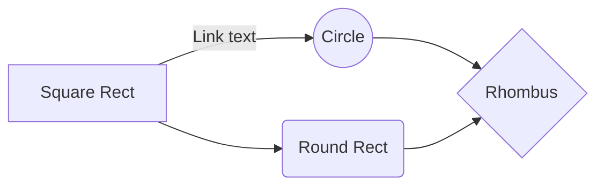

# Town of Whispers
### September 16, 2020

```mermaid
graph LR
A[Square Rect] -- Link text --> B((Circle))
A --> C(Round Rect)
B --> D{Rhombus}
C --> D
```

$-b \pm \sqrt{b^2 - 4ac} \over 2a$
$x = a_0 + \frac{1}{a_1 + \frac{1}{a_2 + \frac{1}{a_3 + a_4}}}$
$\forall x \in X, \quad \exists y \leq \epsilon$

